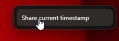

# InstaReel Controls

Adds TikTok-style volume and playback controls to Instagram Reels on the web.

## Features
- Vertical volume slider that opens from the native Instagram sound button
- Click to open slider, click again to toggle mute, double click to mute
- Progress bar with time and play/pause status
- Remembers your volume level across sessions
- Right-click a reel to copy a "share current timestamp" link

## Install (Chrome, unpacked)
1. Open `chrome://extensions`.
2. Enable Developer mode.
3. Click "Load unpacked" and select this folder.

## Repo
GitHub: https://github.com/cealiax3/InstaReel-Controls

## Usage
- Hover or click the Instagram sound button to open the volume slider.
- Drag the slider to adjust volume (saved automatically).
- Right-click a reel and pick "Share current timestamp" to copy a link.

## Screenshots

## Notes
- Works on `instagram.com` pages that contain `<video>` elements.
- Firefox and Chrome Web Store releases are planned later.

## Development
- Edit `content.js` and `content.css`.
- Reload the extension from `chrome://extensions` after changes.

## Privacy
All processing runs locally in your browser. No data is sent anywhere.

## License
MIT - see `LICENSE`.
